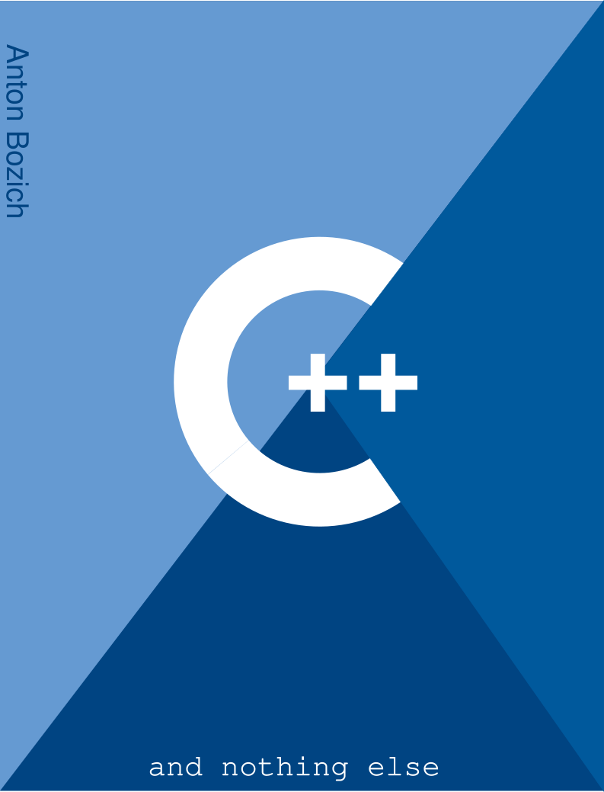

# C++ And Nothing Else / RU 

> В этой книге планируеться рассмотреть язык С++ как таковой. То есть мы ограничимся созданием консольных приложений, но мы выучим С++ на должном уровне.

# Для кого книга?
- Для тех, кто хоть как-то знает, как программировать хоть на каком-то из языков ниже (или им подобным): Python, JavaScript, Swift, Go, C#… И да, в этой книге мы будем сравнивать С++ с языками JavaScript и Python 

> *Лично я хорошо знаю Python и JavaScript.

> Если вы полный ноль в программировании как таковом и решились учить С++ (не рекомендовано учить его первым), то прочтите мою же книгу «C++ From Scratch (Bozich)». Где, собственно, вы изучите С++ сравнивая его с Scratch. Но это будут основы основ (синтаксис, переменные, операторы, условия, циклы итп) (далее можете приступить к этой книге).

# Соденжание

> ## [Глава 1. Основы основ.]()
> * [Первая программа.]()
> * [Переменные.]()
> * [Арифметические операторы.]()
> * [Приоритеты операторов.]()
> * [Ввод / Вывод.]()
> * [Условия, условные операторы.]()
> * [Циклы.]()
> * [Массивы, их методы.]()
> * [Строки, их методы.]()
> * [Функции.]()
> * [ООП (Поверхносно).]()
> * [Модули.]()
> * [Также.]()
> * [Подитожим.]()
